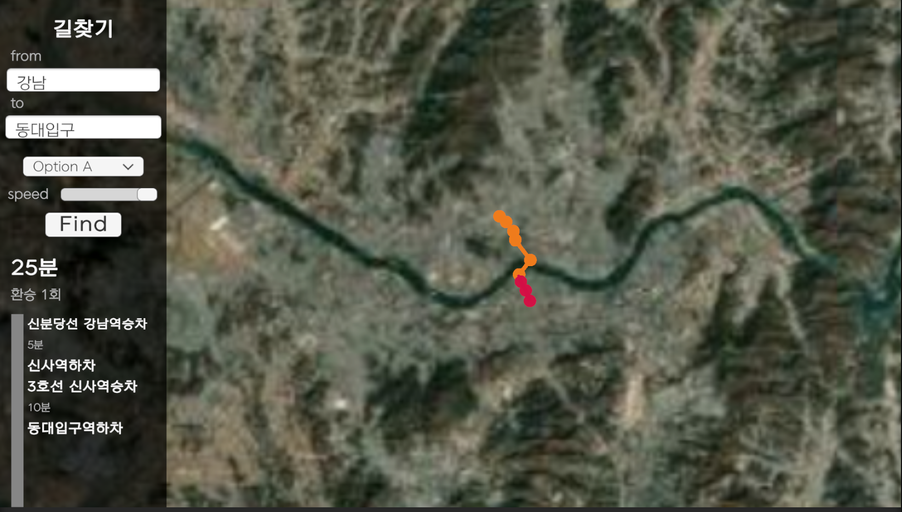
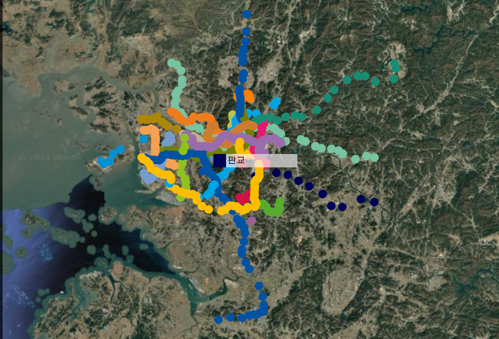

# SubwayRouteFinder

## 유니티로 만든 수도권 지하철 길찾기 프로그램

출발 역과 도착 역을 선택하면 다익스트라 알고리즘을 통해 최단 경로를 찾아준다.

- 공공데이터포털의 역 정보 시각화
- 역간 소요시간 데이터 생성
- 출발역에서 도착역까지의 최단 경로 계산
- 다익스트라 알고리즘의 시각화

### 배운 점

1. 길찾기 알고리즘을 실생활에 적용해보기
2. 공공 데이터를 변형하고 추출하여 용도에 맞게 사용하기

## 활용 가능한 데이터

### 1. 역 위치 정보
- 경로: SeoulMetroVisualizer/Assets/Scripts/Data/stationPositions.json
  
사용 설명
- 각각의 역에 대한 역 이름, 역 코드, 열차명, 위도, 경도 정보를 포함한다.
- 같은 역이어도 다른 열차가 지나가는 경우 개별적인 역 코드를 가진다.

### 2. 역 간 소요시간
- 경로: SeoulMetroVisualizer/Assets/Scripts/Data/timeBetweenStations.json
  
사용 설명
- 인접한 두 역간의 소요시간을 json 파일로 저장한다.
- 역 정보는 역 코드를 사용하고 시간은 분 단위로 저장한다.
- 역방향 소요시간은 포함하지 않는다. (서울역->시청역의 데이터가 있는경우 시청역->서울역은 같은 시간으로 간주하여 생략한다)